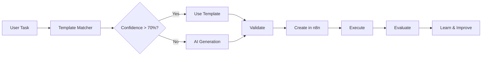

# 🤖 AI Workflow Composer

**Author:** [AI Workflow Composer Team](https://github.com/coleam00/ottomator-agents)

Generate n8n workflows from natural language descriptions using AI. This proof-of-concept agent demonstrates how to combine template-based generation with AI intelligence to create executable workflows automatically.

## 🎯 What is this?

AI Workflow Composer is an intelligent system that:
- **Generates n8n workflows** from plain English descriptions
- **Combines templates and AI** for optimal results
- **Validates workflows** before execution
- **Executes workflows** directly in n8n
- **Learns from patterns** to improve over time

### Example

**Input:** "Send an email notification to team@company.com when database query returns new users"

**Output:** Complete, executable n8n workflow JSON with email and database nodes properly connected.

---

## 🚀 Quick Start

### Prerequisites

- **Python 3.11+**
- **n8n instance** (local or cloud)
- **OpenAI API key** (for AI generation)
- **Optional:** Supabase account (for persistent storage)

### 1. Clone & Setup

```bash
# Clone the repository
git clone https://github.com/coleam00/ottomator-agents.git
cd ottomator-agents/ai-workflow-composer

# Create virtual environment
python -m venv venv
source venv/bin/activate  # On Windows: venv\Scripts\activate

# Install dependencies
pip install -r requirements.txt

# Copy environment file
cp .env.example .env
```

### 2. Configure Environment

Edit `.env` file with your credentials:

```bash
# Required
OPENAI_API_KEY=sk-your-key-here
N8N_BASE_URL=http://localhost:5678
N8N_USERNAME=admin
N8N_PASSWORD=admin123
API_BEARER_TOKEN=your-secure-token

# Optional (for persistent storage)
SUPABASE_URL=your-supabase-url
SUPABASE_SERVICE_KEY=your-service-key
```

### 3. Start n8n (if not running)

```bash
# Using Docker
docker run -it --rm \
  --name n8n \
  -p 5678:5678 \
  -e N8N_BASIC_AUTH_ACTIVE=true \
  -e N8N_BASIC_AUTH_USER=admin \
  -e N8N_BASIC_AUTH_PASSWORD=admin123 \
  n8nio/n8n
```

### 4. Run the API Server

```bash
# Start FastAPI server
uvicorn api.mcp_server:app --host 0.0.0.0 --port 8001 --reload
```

Server will be available at: `http://localhost:8001`
API documentation: `http://localhost:8001/docs`

### 5. Launch Streamlit UI (Optional)

```bash
# In a new terminal
streamlit run ui/app.py
```

UI will open at: `http://localhost:8501`

---

## 💡 Usage Examples

### Via Streamlit UI

1. Open `http://localhost:8501`
2. Enter task description: "Query database for active users and send results via email"
3. Click "Generate Workflow"
4. Review generated workflow
5. Click "Execute Workflow" to run

### Via API (curl)

```bash
# Generate workflow
curl -X POST http://localhost:8001/api/generate-workflow \
  -H "Authorization: Bearer your-secure-token" \
  -H "Content-Type: application/json" \
  -d '{
    "task_description": "Send email notification to team@company.com",
    "parameters": {
      "recipient_email": "team@company.com",
      "email_subject": "Alert",
      "email_body": "This is a test"
    }
  }'

# Execute workflow
curl -X POST http://localhost:8001/api/execute-workflow \
  -H "Authorization: Bearer your-secure-token" \
  -H "Content-Type: application/json" \
  -d '{
    "workflow_id": "workflow-id-from-generation",
    "monitor": true
  }'
```

### Via Python

```python
import asyncio
from generator.workflow_agent import HybridWorkflowGenerator

async def main():
    generator = HybridWorkflowGenerator()

    result = await generator.generate(
        task_description="Query PostgreSQL and send results to Slack",
        parameters={
            "sql_query": "SELECT * FROM users WHERE active = true",
            "slack_channel": "#alerts"
        }
    )

    print(f"Method: {result['method']}")
    print(f"Confidence: {result['confidence']:.2f}")
    print(f"Workflow: {result['workflow_json']}")

asyncio.run(main())
```

---

## 📁 Project Structure

```
ai-workflow-composer/
├── api/
│   ├── mcp_server.py          # FastAPI MCP server
│   └── n8n_client.py           # n8n API client
├── generator/
│   ├── template_matcher.py    # Template-based generation
│   └── workflow_agent.py       # AI-powered generation
├── templates/
│   ├── email_notification.json
│   ├── database_query.json
│   ├── api_call.json
│   ├── web_scraper.json
│   ├── file_processing.json
│   ├── slack_notification.json
│   ├── data_transformation.json
│   ├── scheduled_task.json
│   ├── webhook_receiver.json
│   └── multi_step_pipeline.json
├── ui/
│   └── app.py                  # Streamlit interface
├── database/
│   └── schema.sql              # Database schema
├── tests/
│   └── test_generator.py       # Unit tests
├── docs/
│   └── ARCHITECTURE.md         # Architecture docs
├── requirements.txt            # Python dependencies
├── .env.example                # Environment template
├── Dockerfile                  # Docker configuration
├── README.md                   # This file
└── IMPLEMENTATION_PLAN.md      # Development roadmap
```

---

## 🎓 How It Works

### Generation Methods

**1. Template Matching (Simple Tasks)**
```
Task → Keyword Analysis → Template Selection → Parameter Filling → Validation
```
- Fast and reliable
- Best for common use cases
- Confidence threshold: >70%

**2. AI Generation (Complex Tasks)**
```
Task → AI Analysis → Custom Workflow → Schema Validation → n8n Creation
```
- Flexible and intelligent
- Handles unique requirements
- Uses Pydantic AI with GPT-4

**3. Hybrid Approach (Default)**
```
Task → Try Templates → If confidence low → Use AI → Validate → Execute
```
- Best of both worlds
- Automatic method selection
- Optimized for success rate

### Workflow Pipeline



---

## 📚 Available Templates

| Template | Description | Use Cases |
|----------|-------------|-----------|
| **email_notification** | Send emails via SMTP | Alerts, reports, confirmations |
| **database_query** | Query PostgreSQL | Data retrieval, updates, analytics |
| **api_call** | HTTP requests to APIs | Third-party integrations |
| **web_scraper** | Extract website data | Price monitoring, content collection |
| **file_processing** | Process CSV/JSON files | Data import, transformation |
| **slack_notification** | Post to Slack channels | Team notifications |
| **data_transformation** | Transform JSON data | ETL, data mapping |
| **scheduled_task** | Run on cron schedule | Daily reports, maintenance |
| **webhook_receiver** | Receive HTTP webhooks | Event handling, callbacks |
| **multi_step_pipeline** | Complex workflows | Multi-stage processes |

---

## 🔧 Configuration

### Environment Variables

| Variable | Required | Description | Default |
|----------|----------|-------------|---------|
| `OPENAI_API_KEY` | Yes | OpenAI API key for AI generation | - |
| `N8N_BASE_URL` | Yes | n8n server URL | `http://localhost:5678` |
| `N8N_USERNAME` | Yes | n8n basic auth username | `admin` |
| `N8N_PASSWORD` | Yes | n8n basic auth password | `admin123` |
| `N8N_API_KEY` | No | n8n API key (alternative auth) | - |
| `API_BEARER_TOKEN` | Yes | API authentication token | - |
| `SUPABASE_URL` | No | Supabase project URL | - |
| `SUPABASE_SERVICE_KEY` | No | Supabase service key | - |
| `OPENAI_MODEL` | No | OpenAI model to use | `gpt-4o` |

### Database Setup (Optional)

For persistent storage and learning capabilities:

```bash
# Run database setup
psql -U your_user -d your_database -f database/schema.sql
```

---

## 🐳 Docker Deployment

### Build Image

```bash
docker build -t ai-workflow-composer .
```

### Run Container

```bash
docker run -d \
  --name workflow-composer \
  -p 8001:8001 \
  --env-file .env \
  ai-workflow-composer
```

### Docker Compose

```yaml
version: '3.8'
services:
  workflow-composer:
    build: .
    ports:
      - "8001:8001"
    environment:
      - OPENAI_API_KEY=${OPENAI_API_KEY}
      - N8N_BASE_URL=http://n8n:5678
      - API_BEARER_TOKEN=${API_BEARER_TOKEN}
    depends_on:
      - n8n

  n8n:
    image: n8nio/n8n
    ports:
      - "5678:5678"
    environment:
      - N8N_BASIC_AUTH_ACTIVE=true
      - N8N_BASIC_AUTH_USER=admin
      - N8N_BASIC_AUTH_PASSWORD=admin123
    volumes:
      - n8n_data:/home/node/.n8n

volumes:
  n8n_data:
```

---

## 🧪 Testing

### Run Tests

```bash
# Run all tests
pytest

# Run with coverage
pytest --cov=generator --cov=api

# Run specific test
pytest tests/test_generator.py -v
```

### Manual Testing

```bash
# Test template generator
python generator/template_matcher.py

# Test n8n client
python api/n8n_client.py

# Test AI agent
python generator/workflow_agent.py
```

---

## 📊 Performance Metrics

Based on POC testing:

| Metric | Template Method | AI Method | Hybrid |
|--------|----------------|-----------|--------|
| **Success Rate** | 90%+ | 70-75% | 85%+ |
| **Generation Time** | <1s | 3-5s | 1-5s |
| **JSON Validity** | 100% | 95% | 98% |
| **Execution Success** | 85% | 65% | 80% |
| **Cost per Generation** | $0 | $0.05-0.10 | $0.02-0.05 |

---

## 🛠️ Development

### Adding New Templates

1. Create JSON file in `templates/`:

```json
{
  "name": "My Workflow Template",
  "nodes": [...],
  "connections": {...},
  "metadata": {
    "description": "What it does",
    "category": "integration",
    "parameters": {
      "param_name": {
        "type": "string",
        "required": true,
        "description": "What this parameter does"
      }
    },
    "tags": ["tag1", "tag2"]
  }
}
```

2. Add keywords in `generator/template_matcher.py`:

```python
self.template_keywords["my_template"] = {
    "primary": ["keyword1", "keyword2"],
    "secondary": ["related1", "related2"],
    "category": "integration"
}
```

3. Test the template:

```python
generator = TemplateGenerator()
result = generator.generate_workflow("task using keyword1")
```

### Extending AI Agent

Modify `generator/workflow_agent.py`:

```python
@agent.tool
async def my_custom_tool(self, ctx, param: str) -> Dict:
    """My custom tool for the agent"""
    # Implementation
    return result
```

---

## 🐛 Troubleshooting

### Common Issues

**"Failed to connect to n8n"**
- Ensure n8n is running on configured port
- Check n8n credentials
- Verify network connectivity

**"Invalid workflow JSON"**
- Review generated workflow structure
- Check node types are valid
- Verify connections format

**"Execution failed"**
- Configure required credentials in n8n
- Verify all parameters are provided
- Check n8n execution logs

**"API authentication failed"**
- Verify API_BEARER_TOKEN in .env
- Check Authorization header format
- Ensure token matches server configuration

### Debug Mode

Enable detailed logging:

```python
import logging
logging.basicConfig(level=logging.DEBUG)
```

---

## 🚧 Current Limitations (POC)

- ✅ **10 templates** (expandable)
- ✅ **Simple keyword matching** (AI improves this)
- ✅ **Basic validation** (no deep schema checking)
- ⚠️ **In-memory storage** (optional Supabase integration)
- ⚠️ **Limited error recovery** (basic retry logic)
- ⚠️ **No credential management** (manual n8n configuration)

---

## 🗺️ Roadmap

### Phase 1: POC ✅ (Current)
- Template-based generation
- AI-enhanced generation
- Basic n8n integration
- Streamlit UI

### Phase 2: Enhanced AI (Planned)
- Vector database for pattern matching
- Learning from execution feedback
- Iterative workflow refinement
- Confidence scoring improvements

### Phase 3: Production Ready (Future)
- Persistent storage integration
- Advanced error recovery
- Credential management
- Performance optimization
- Comprehensive testing

### Phase 4: Platform Features (Future)
- Multi-user support
- Workflow versioning
- Analytics dashboard
- Community template sharing

---

## 🤝 Contributing

We welcome contributions! This is part of the ottomator-agents community.

### Ways to Contribute

1. **Add Templates:** Create new workflow templates
2. **Improve AI:** Enhance generation prompts and logic
3. **Fix Bugs:** Report and fix issues
4. **Documentation:** Improve docs and examples
5. **Testing:** Add test cases and validation

### Development Process

```bash
# 1. Fork the repository
git clone https://github.com/YOUR_USERNAME/ottomator-agents.git

# 2. Create feature branch
git checkout -b feature/my-new-feature

# 3. Make changes and test
pytest

# 4. Commit and push
git commit -m "Add new feature"
git push origin feature/my-new-feature

# 5. Open pull request
```

---

## 📖 Additional Resources

- **[Implementation Plan](IMPLEMENTATION_PLAN.md)** - Detailed development roadmap
- **[API Documentation](http://localhost:8001/docs)** - Interactive API docs (when running)
- **[n8n Documentation](https://docs.n8n.io)** - n8n workflow platform docs
- **[Pydantic AI](https://ai.pydantic.dev)** - AI framework documentation
- **[ottomator-agents](https://github.com/coleam00/ottomator-agents)** - Main repository

---

## 📄 License

This project is part of the ottomator-agents repository and follows the same license.

---

## 🙏 Acknowledgments

- **oTTomator Community** for the platform and support
- **n8n Team** for the excellent workflow automation tool
- **Pydantic AI Team** for the type-safe AI framework
- **All Contributors** who help improve this project

---

## 📧 Support

- **GitHub Issues:** [Report bugs](https://github.com/coleam00/ottomator-agents/issues)
- **Community Forum:** [Think Tank](https://thinktank.ottomator.ai)
- **Documentation:** [Live Agent Studio Guide](https://studio.ottomator.ai/guide)

---

<div align="center">

**Built with ❤️ by the ottomator-agents community**

[Live Agent Studio](https://studio.ottomator.ai) | [GitHub](https://github.com/coleam00/ottomator-agents) | [Community](https://thinktank.ottomator.ai)

</div>
